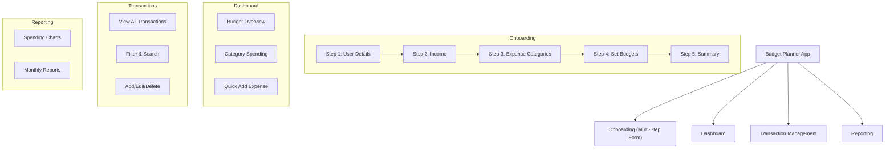

# Angular Signal-Powered Budget Planner

This project is a modern budget planner application built with Angular 20. It's designed to serve as a comprehensive learning project, leveraging the latest features of the Angular framework, including Signals for state management, standalone components, and modern best practices.

The application will guide users through a multi-step onboarding process to personalize their budget and then provide them with a dashboard to manage their finances effectively.

## Project Architecture

Below is a diagram outlining the high-level architecture of the budget planner application.



## Core Features

-   **Multi-Step Onboarding Form:** A user-friendly, multi-step form to set up initial user settings, income sources, expense categories, and budget thresholds.
-   **Interactive Dashboard:** A visual overview of the user's financial status, including total income, expenses, remaining budget, and spending by category.
-   **Transaction Management:** A comprehensive view of all transactions with filtering, sorting, and CRUD (Create, Read, Update, Delete) operations.
-   **Reporting:** Visual reports and charts to help users understand their spending habits over time.

## Modern Angular Concepts Utilized

This project will be built using the latest features and architectural patterns from Angular 20:

-   **Angular Signals:** Used for reactive state management throughout the application, from local component state to more complex global state scenarios.
-   **Standalone Components:** The entire application is built with standalone components, eliminating the need for `NgModules` and simplifying the overall architecture.
-   **Services & `inject()`:** Shared logic and state will be managed through services, injected into components using the modern, functional `inject()` approach.
-   **Reactive Forms:** The multi-step onboarding process will be built using Angular's powerful Reactive Forms for robust and scalable form management.
-   **Lazy Loading:** Feature modules will be lazy-loaded to improve the initial application load time and overall performance.
-   **NgRx Signal Store (Optional):** For more advanced state management, the project may explore using NgRx Signal Store as a lightweight, signal-based alternative to traditional Redux patterns.

## Development server

To start a local development server, run:

```bash
ng serve
```

Navigate to `http://localhost:4200/`. The application will automatically reload if you change any of the source files.

## Code scaffolding

Angular CLI includes powerful code scaffolding tools. To generate a new component, run:

```bash
ng generate component component-name
```

For a complete list of available schematics (such as `components`, `directives`, or `pipes`), run:

```bash
ng generate --help
```

## Building

To build the project run:

```bash
ng build
```

This will compile your project and store the build artifacts in the `dist/` directory. By default, the production build optimizes your application for performance and speed.

## Running unit tests

To execute unit tests with the [Karma](https://karma-runner.github.io) test runner, use the following command:

```bash
ng test
```

## Running end-to-end tests

For end-to-end (e2e) testing, run:

```bash
ng e2e
```

Angular CLI does not come with an end-to-end testing framework by default. You can choose one that suits your needs.

## Additional Resources

For more information on using the Angular CLI, including detailed command references, visit the [Angular CLI Overview and Command Reference](https://angular.dev/tools/cli) page.
